# Vibook - API

## Table of Contents

- [Project](#project)
  * [Links to Deployed Project](#links-to-deployed-project)
- [Project Structure](#project-structure)
- [Agile Workflow](#agile-workflow)
  * [Github Project Board](#github-project-board)
  * [Developer User Stories](#user-stories)
- [Database Design](#database-design)
  * [Entity Relationship Diagram](#entity-relationship-diagram)
  * [Models](#models-and-crud-breakdown)
- [Features](#features)
  * [Homepage](#homepage)
  * [Profiles Data](#profile-data)
  * [Post Data](#posts-data)
  * [Comments Data](#comments-data)
  * [Followers Data](#followers-data)
  * [Likes Data](#likes-data)  
- [Testing](#testing)
- [Deployment](#deployment)
- [Credits](#credits)

## Project description
Vibook is a social media platform. It has been designed for its users to share parties and party venues with other users. The application consists of the React app and an API. Welcome to the Django Rest Framework API project section.

## Links to Deployed Project

  + The project is deployed on Heroku and is available at the folowing link: [Deployed Vibook API](https://vibook-api-259e45270715.herokuapp.com/)
  + The link for the GitHub repo to corresponding front end for this project is here: [Vibook Front End](https://github.com/alelodato/vibook)

## Project Structure

The overall structure of the project was modelled on the [drf-api](https://github.com/Code-Institute-Solutions/drf-api) walkthrough due to time constraints and the Project 5 assessments requirements including most of what is included in the walkthrough project.
However, I have tried to customize the walkthrough models somewhat to meet the project requirements. 

# Agile Workflow

## Github Project Board

I used the Kanban project board in Github to build this API using Agile principles from the start. The user stories created are for a developer or superuser to follow and test throughout the build process. I created a Milestone for each app (model) that I created, which I used to mark out the individual sprints of the project, and within each milestone are the related developer user stories. 

Each user story has a level of prioritisation using the MoSCoW method and a number of User Story points to indicate the level of difficulty for that feature. 

When each feature was built and committed in GitPod, the commit message has been linked to the relevant User Story. 


## User stories
| Category  | as | I want to           | so that I can                                                                                    | mapping API feature                          |
| --------- | -------- | ------------------------------ | ------------------------------------------------------------------------------------------------ | -------------------------------------------- |
| auth      | user     | register for an account        | have a personal profile with a picture                                                           | dj-rest-auth<br>Create profile (signals)     |
| auth      | user     | register for an account        | create, like and comment on posts                                                                | Create post<br>Create comment<br>Create like |
| auth      | user     | register for an account        | follow users                                                                                     | Create follower                              |
| posts     | visitor  | view a list of posts           | browse the most recent uploads                                                                   | List/ Filter posts                           |
| posts     | visitor  | view an individual post        | see user feedback, i.e. likes and read comments                                                  | Retrieve post                                |
| posts     | visitor  | search a list of posts         | find a post by a specific artist or a title                                                      | List/ Filter posts                           |
| posts     | visitor  | scroll through a list of posts | browse the site more comfortably                                                                 | List/ Filter posts                           |
| posts     | user     | edit and delete my post        | correct or hide any mistakes                                                                     | Update property<br>Destroy property          |
| posts     | user     | create a post                  | share my moments with others                                                                     | Create post                                  |
| posts     | user     | view liked posts               | go back often to my favourite posts                                                              | List/ Filter posts                           |
| posts     | user     | view followed users' posts     | keep up with my favourite users' moments                                                         | List/ Filter posts                           |
| likes     | user     | like a post                    | express my interest in someone's shared moment                                                   | Create like                                  |
| likes     | user     | unlike a post                  | express that my interest in someone's shared moment has faded away                               | Destroy like                                 |
| comments  | user     | create a comment               | share my thoughts on other people's content                                                      | Create comment                               |
| comments  | user     | edit and delete my comment     | correct or hide any mistakes                                                                     | Update comment<br>Destroy comment            |
| profiles  | user     | view a profile                 | see a user's recent posts + post, followers, following count data                                | Retrieve profile<br>List/ filter posts       |
| profiles  | user     | edit a profile                 | update my profile information                                                                    | Update profile                               |
| followers | user     | follow a profile               | express my interest in someone's content                                                         | Create follower                              |
| followers | user     | unfollow a profile             | express that my interest in someone's content has faded away and remove their posts from my feed | Destroy follower                             |

# Database Design

## Entity Relationship Diagram


## Models and CRUD breakdown
| model     | endpoints                    | create        | retrieve | update | delete | filter                   | text search |
| --------- | ---------------------------- | ------------- | -------- | ------ | ------ | ------------------------ | ----------- |
| users     | users/<br>users/:id/         | yes           | yes      | yes    | no     | no                       | no          |
| profiles  | profiles/<br>profiles/:id/   | yes (signals) | yes      | yes    | no     | following<br>followed    | name        |
| likes     | likes/<br>likes/:id/         | yes           | yes      | no     | yes    | no                       | no          |
| comments  | comments/<br>comments/:id/   | yes           | yes      | yes    | yes    | post                     | no          |
| followers | followers/<br>followers/:id/ | yes           | yes      | no     | yes    | no                       | no          |
| posts     | posts/<br>posts/:id/         | yes           | yes      | yes    | yes    | profile<br>liked<br>feed | title       |

# Features

## Homepage

When you first enter the API site, you are directed to the Root Route hompage, with a message welcoming you to the API for Happening. 

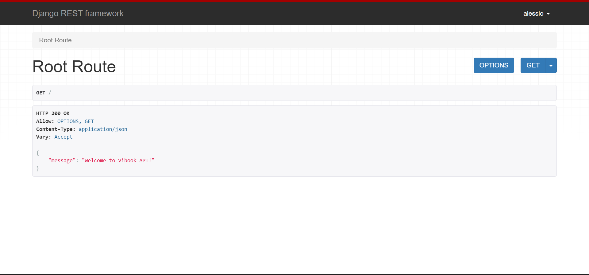

## Profile Data

Within the Profile List section, a user can view a list of all profiles in the API. Create functionality is not enabled, as the process is done automatically through the user registration process in the django admin panel. 

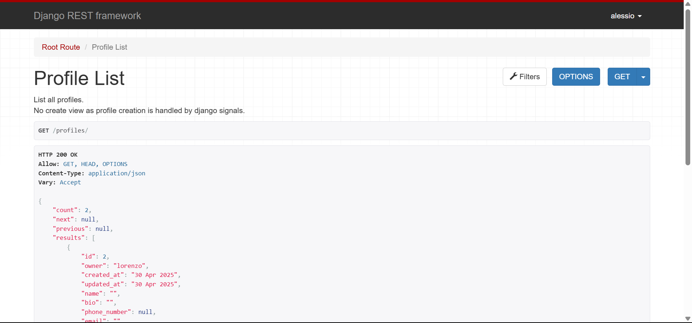

These are the fields in the profile list, created in the Profile model and added to the JSON data through the serializer:

* id
* owner
* created_at
* updated_at
* name
* bio
* phone number
* email
* content
* image
* is_owner
* following_id
* posts_count
* followers_count
* following_count

I have set up ordering for the profile list, and selected the following parameters to sort the profiles by:

* posts_count
* followers_count
* following_count
* owner__following_created_at
* owner__followed_created_at

If the user logs in, and views the detail of their own profile, additional Update and Delete functionality becomes available. Below the profile data, a pre-populated form is available to edit the profile model fields. At the top of the screen, a delete button is available to delete the profile from the API.

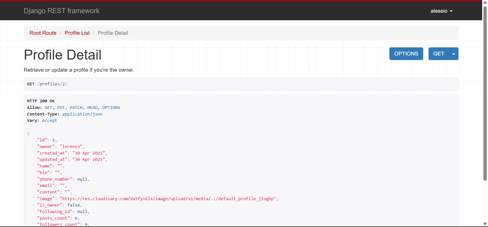

## Posts Data

Within the Posts List section, a user can view a list of all events in the API. 

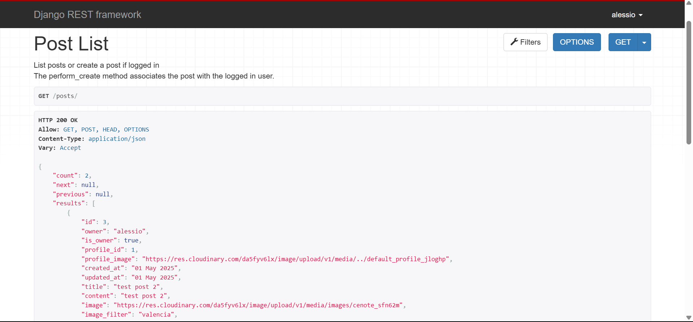

These are the fields in the posts list, created in the Post model and addedd to the JSON data through the serializer:

* id
* owner
* is_owner
* profile_id
* profile_image
* created_at
* updated_at
* title
* content
* image
* image_filter
* like_id
* likes_count
* comments_count

I have set up ordering for the events list, and selected the following parameters to sort the events by:

* likes_count
* comments_count
* likes_created_at

I have set up a search function whereby the full posts list can be searched on by the post owner, title, data, or tags.

If the user logs in, a form becomes visible under the events list to create a new post. 

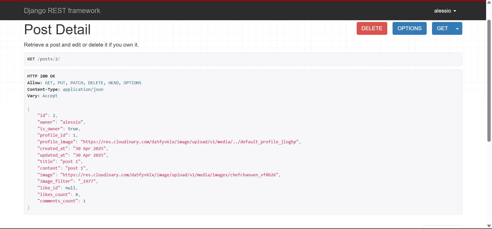

Once logged in, if the user views the details of a single post which they created additional Update and Delete functionality becomes available. Below the post data, a pre-populated form is available to edit the post. At the top of the screen, a delete button is available to delete it from the API.


## Comments Data

Within the Comments List section, a user can view a list of all comments in the API. 

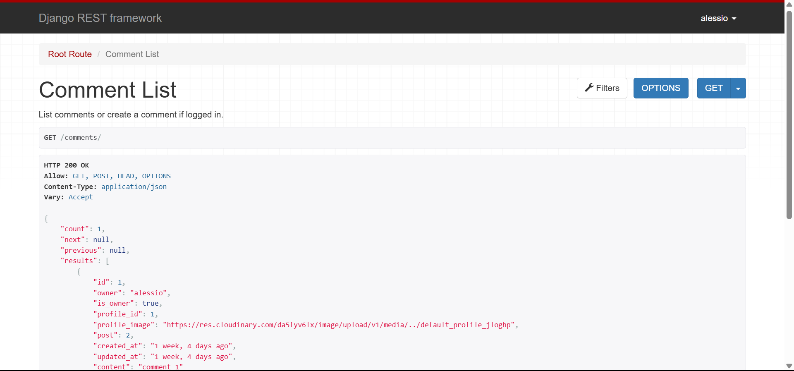

These are the fields in the comments list, created in the Comment model and addedd to the JSON data through the serializer:

* id
* owner
* is_owner
* profile_id
* profile_image
* post
* created_at
* updated_at
* content

I also set up one field filter to filter the comments by the post they are commenting on.

If the user logs in, a form becomes visible under the comments list to create a new comment. The post they want to comment on can be selected from the dropdown, and a comment text must be entered to post the comment successfully.

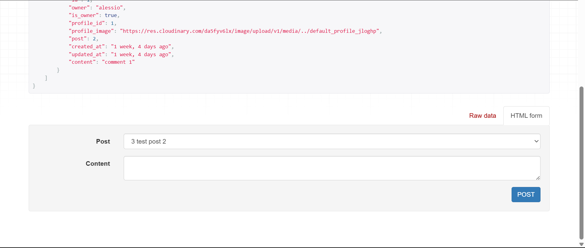

Once logged in, if the user views the details of a single comment which they created additional Update and Delete functionality becomes available. Below the comment data, a pre-populated form is available to edit the comment. At the top of the screen, a delete button is available to delete the comment from the API.

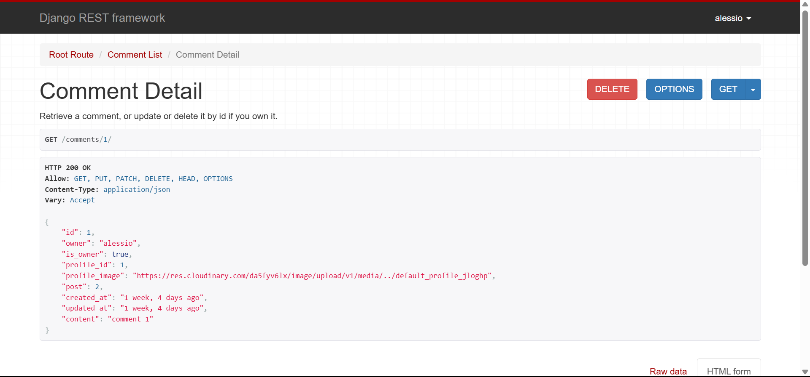

## Followers Data

Within the Follower List section, a user can view a list of all follower posts in the API. 

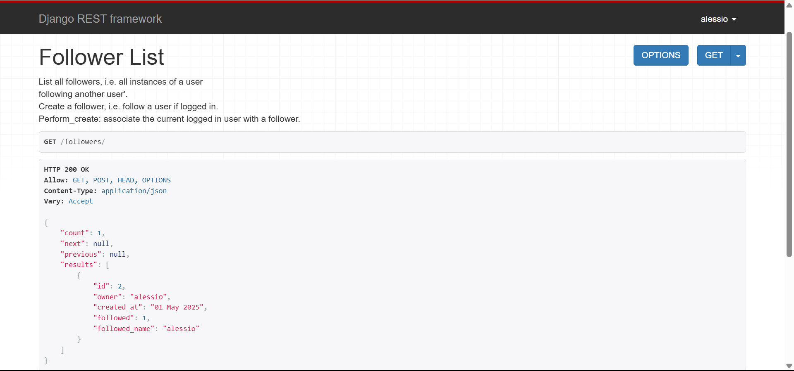

If the user logs in, a form becomes visible under the follower list to create a new follower post. The user they want to follow can be selected from the dropdown, to link the follower post with another user profile.


If a user tries to follow the same profile twice, they see an error message saying that they are already following the selected profile, and the duplicate follow post is not created.


Once logged in, if the user views the details of a single follower post which they created additional Delete functionality becomes available. It is not possible to Edit a follower post.


## Likes Data

Within the Going List section, a user can view a list of all going posts in the API. 

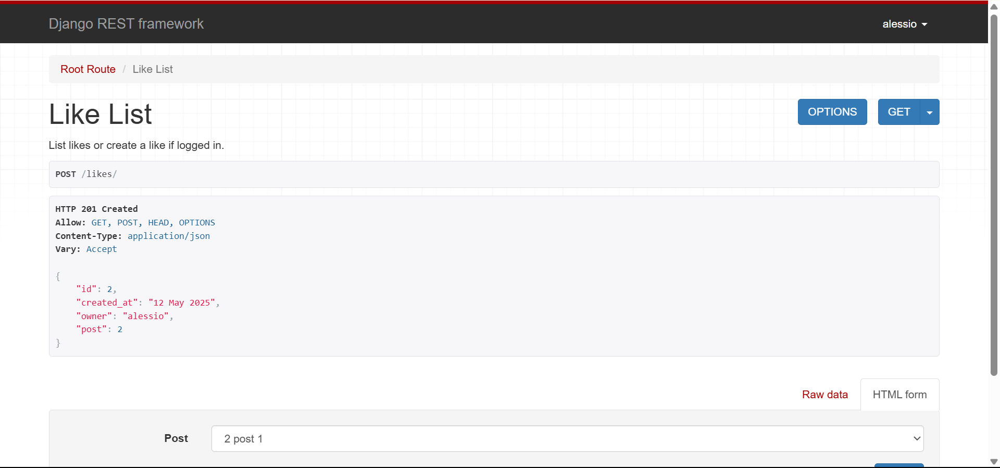

If the user logs in, a form becomes visible under the going list to create a new going post. The event they want to be going to can be selected from the dropdown, to link the going post with the event.

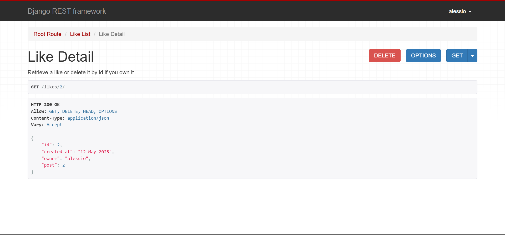

# Tests

## Code Validation 

### PEP8

The Vibook Api code has been passed into the Code Institute Pep8 Validator to make sure code passes python validation:

### Vibook_api files

* permissions.py - No problems or warnings found
* serializers.py - No problems or warnings found
* views.py - No problems or warnings found
* models.py - No problems or warnings found
* urls.py - No problems or warnings found

### Profiles App py files

* models.py - No problems or warnings found
* serializers.py - No problems or warnings found
* tests.py - No problems or warnings found
* urls.py - No problems or warnings found
* views.py - No problems or warnings found

### Posts App py files

* models.py - No problems or warnings found
* serializers.py - No problems or warnings found
* tests.py - No problems or warnings found
* urls.py - No problems or warnings found
* views.py - No problems or warnings found

### Comments App py files

* models.py - No problems or warnings found
* serializers.py - No problems or warnings found
* tests.py - No problems or warnings found
* urls.py - No problems or warnings found
* views.py - No problems or warnings found

### Followers App py files

* models.py - No problems or warnings found
* serializers.py - No problems or warnings found
* tests.py - No problems or warnings found
* urls.py - No problems or warnings found
* views.py - No problems or warnings found

### Likes App py files

* models.py - No problems or warnings found
* serializers.py - No problems or warnings found
* tests.py - No problems or warnings found
* urls.py - No problems or warnings found
* views.py - No problems or warnings found

## Automated Testing

The following automatic tests have been written into the Vibook API, in order to cover all the user story scenarios. These are the tests that were created: 


| Status | **Profiles**
|:-------:|:--------|
| &check; | Profile automatically created on user creation
| &check; | Can list profiles
| &check; | Can retrieve profile using valid ID
| &check; | Can't retrieve profile using invalid ID
| &check; | Can update own profile
| &check; | Can't update someone else's profile
| &check; | Can delete own profile
| &check; | Can't delete someone else's profile

| Status | **Events**
|:-------:|:--------|
| &check; | Can list events
| &check; | Logged out user can't create event
| &check; | Logged in user can create event
| &check; | Can retrieve event using valid ID
| &check; | Can't retrieve event using invalid ID
| &check; | Can update own event
| &check; | Can't update someone else's event
| &check; | Can delete own event
| &check; | Can't delete someone else's event

| Status | **Interested**
|:-------:|:--------|
| &check; | Can list interested
| &check; | Logged out user can't create interested
| &check; | Logged in user can create interested
| &check; | Can retrieve interested using valid ID
| &check; | Can't retrieve interested using invalid ID
| &check; | Can delete own interested
| &check; | Can't delete someone else's interested
| &check; | Can't post interested to the same event twice

| Status | **Going**
|:-------:|:--------|
| &check; | Can list going
| &check; | Logged out user can't create going
| &check; | Logged in user can create going
| &check; | Can retrieve going using valid ID
| &check; | Can't retrieve going using invalid ID
| &check; | Can delete own going
| &check; | Can't delete someone else's going
| &check; | Can't post going to the same event twice

| Status | **Comments**
|:-------:|:--------|
| &check; | Can list comments
| &check; | Logged out user can't create comment
| &check; | Logged in user can create comment
| &check; | Can retrieve comment using valid ID
| &check; | Can't retrieve comment using invalid ID
| &check; | Can update own comment
| &check; | Can't update someone else's comment
| &check; | Can delete own comment
| &check; | Can't delete someone else's comment

| Status | **Reviews**
|:-------:|:--------|
| &check; | Can list reviews
| &check; | Logged out user can't create review
| &check; | Logged in user can create review
| &check; | Can retrieve review using valid ID
| &check; | Can't retrieve review using invalid ID
| &check; | Can update own review
| &check; | Can't update someone else's review
| &check; | Can delete own review
| &check; | Can't delete someone else's review
| &check; | Can't review the same event twice

| Status | **Followers**
|:-------:|:--------|
| &check; | Can list followers
| &check; | Logged out user can't follow
| &check; | Logged in user can follow
| &check; | Can retrieve followers using valid ID
| &check; | Can't retrieve followers using invalid ID
| &check; | Can delete follow from my own profile
| &check; | Can't delete someone else's follow
| &check; | Can't follow the same profile twice

| Status | **Contact**
|:-------:|:--------|
| &check; | Can list contacts
| &check; | Logged out user can't create contact
| &cross; | Logged in user can create contact
| &check; | Can retrieve contact using valid ID
| &check; | Can't retrieve contact using invalid ID
| &check; | Can update own contact
| &check; | Can't update someone else's contact
| &check; | Can delete own contact
| &check; | Can't delete someone else's contact

## Manual Testing

As well as the automatic tests which can be found in each app's testing.py file, I carried out the following additional manual tests:

| Status | **Profiles**
|:-------:|:--------|
| &check; | Profile List can be ordered by events_count in ascending order
| &check; | Profile List can be ordered by events_count in descending order
| &check; | Profile List can be ordered by followers_count in ascending order
| &check; | Profile List can be ordered by followers_count in descending order
| &check; | Profile List can be ordered by following_count in ascending order
| &check; | Profile List can be ordered by following_count in descending order
| &check; | Profile List can be ordered by going_count in ascending order
| &check; | Profile List can be ordered by going_count in descending order
| &check; | Profile List can be ordered by owner__following__created_at in ascending order
| &check; | Profile List can be ordered by owner__following__created_at in descending order
| &check; | Profile List can be ordered by owner__followed__created_at in ascending order
| &check; | Profile List can be ordered by owner__followed__created_at in descending order
| &check; | Profile List can be filtered by owner__following__followed__profile
| &check; | Profile List can be filtered by owner__followed__owner__profile

| Status | **Events**
|:-------:|:--------|
| &check; | Event List can be ordered by comments_count in ascending order
| &check; | Event List can be ordered by comments_count in descending order
| &check; | Event List can be ordered by interested_count in ascending order
| &check; | Event List can be ordered by interested_count in descending order
| &check; | Event List can be ordered by going_count in ascending order
| &check; | Event List can be ordered by going_count in descending order
| &check; | Event List can be ordered by review_count in ascending order
| &check; | Event List can be ordered by review_count in descending order
| &check; | Event List can be ordered by average_rating in ascending order
| &check; | Event List can be ordered by average_rating in descending order
| &check; | Event List can be ordered by interested__created_at in ascending order
| &check; | Event List can be ordered by interested__created_at in descending order
| &check; | Event List can be ordered by going__created_at in ascending order
| &check; | Event List can be ordered by going__created_at in descending order
| &check; | Event List can be ordered by event_date in ascending order
| &check; | Event List can be ordered by event_date in descending order
| &check; | Event List can be searched on by owner 'admin'
| &check; | Event List can be searched on by title 'event'
| &check; | Event List can be searched on by tag 'sport'
| &check; | Event List can be searched on by event_date '18'
| &check; | Event List can be searched on by event_date '04' for all April events
| &check; | Event List can be filtered by owner__followed__owner__profile
| &check; | Event List can be filtered by interested__owner__profile
| &check; | Event List can be filtered by going__owner__profile
| &check; | Event List can be filtered by owner__profile
| &check; | Event List can be filtered by category

| Status | **Comments**
|:-------:|:--------|
| &check; | Comment List can be filtered by event

| Status | **Reviews**
|:-------:|:--------|
| &check; | Review List can be filtered by event

| Status | **Contact**
|:-------:|:--------|
| &check; | Logged in user can create a contact message

## Known Bugs

# Technologies Used

## Languages

* [Python](https://en.wikipedia.org/wiki/Python_(programming_language)) - Provides the functionality for the DRF backend framework.

# Deployment

The project was deployed to [Heroku](https://www.heroku.com). To deploy, please follow the process below:

1. To begin with we need to create a GitHub repository from the [Code Institute template](https://github.com/Code-Institute-Org/gitpod-full-template) by following the link and then click 'Use this template'.

2. Fill in the details for the new repository and then click 'Create Repository From Template'.

3. When the repository has been created, click on the 'Gitpod' button to open it in the GitPod Editor.

4. Now it's time to install Django and the supporting libraries that are needed, using the following commands:

* ```pip3 install 'django<4' gunicorn```
* ```pip3 install 'dj_database_url psycopg2```
* ```pip3 install 'dj3-cloudinary-storage```

5. When Django and the libraries are installed we need to create a requirements file.

* ```pip3 freeze --local > requirements.txt``` - This will create and add required libraries to requirements.txt


6. Now it's time to create the project.

* ```django-admin startproject YOUR_PROJECT_NAME .``` - This will create the new project.

7. When the project is created we can now create the applications. My project consists of the following apps; Profiles, Comments, Contact, Events, Followers, Going, Interested and Reviews.

* ```python3 manage.py startapp APP_NAME``` - This will create an application

8. We now need to add the applications to settings.py in the INSTALLED_APPS list.

8. Now it is time to do our first migration and run the server to test that everything works as expected. This is done by writing the commands below.

* ```python3 manage.py makemigrations``` - This will prepare the migrations
* ```python3 manage.py migrate``` - This will migrate the changes
* ```python3 manage.py runserver``` - This runs the server. To test it, click the open browser button that will be visible after the command is run.

9. Now it is time to create our application on Heroku, attach a database, prepare our environment and settings.py file and setup the Cloudinary storage for our static and media files.

* Once signed into your [Heroku](https://www.heroku.com/) account, click on the button labeled 'New' to create a new app. 

10. Choose a unique app name, choose your region and click 'Create app".


11. Next we need to connect an external PostgreSQL database to the app from [ElephantSQL](https://customer.elephantsql.com/login).  Once logged into your ElephantSQL dashboard, you click 'Create New Instance' to create a new database. Give the database a: 
* Name
* Tiny Turtle Free Plan
* Selected data center near you

and click 'Create Instance'. Return to your ElephantSQL Dashboard, and click into your new database instance. Copy the Database URL and head back to Heroku.

12. Back in your Heroku app settings, click on the 'Reveal Config Vars' button. Create a config variable called DATABASE_URL and paste in the URL you copied from ElephantSQL. This connects the database into the app. 

13. Go back to GitPod and create a new env.py in the top level directory. Then add these rows.

* ```import os``` - This imports the os library
* ```os.environ["DATABASE_URL"]``` - This sets the environment variables.
* ```os.environ["SECRET_KEY"]``` - Here you can choose whatever secret key you want.

14. Back in the Heroku Config Vars settings, create another variable called SECRET_KEY and copy in the same secret key as you added into the env.py file. Don't forget to add this env.py file into the .gitignore file so that it isn't commited to GitHub for other users to find. 

15. Now we have to connect to our environment and settings.py file. In the settings.py, add the following code:

```import os```

```import dj_database_url```

```if os.path.isfile("env.py"):```

```import env```

16. In the settings file, remove the insecure secret key and replace it with:
```SECRET_KEY = os.environ.get('SECRET_KEY')```

17. Now we need to comment out the old database settings in the settings.py file (this is because we are going to use the postgres database instead of the sqlite3 database).

Instead, we add the link to the DATABASE_URL that we added to the environment file earlier.

18. Save all your fields and migrate the changes again.

```python3 manage.py migrate```

19. Now we can set up [Cloudinary](https://cloudinary.com/users/login?RelayState=%2Fconsole%2Fmedia_library%2Ffolders%2Fhome%3Fconsole_customer_external_id%3Dc-95a4cb26371c4a6bc47e19b0f130a1#gsc.tab=0) (where we will store our static files). First you need to create a Cloudinary account and from the Cloudinary dashboard copy the API Environment Variable.

20. Go back to the env.py file in Gitpod and add the Cloudinary url (it's very important that the url is correct):

```os.environ["CLOUDINARY_URL"] = "cloudinary://************************"```

21. Let's head back to Heroku and add the Cloudinary url in Config Vars. We also need to add a disable collectstatic variable to get our first deployment to Heroku to work.

22. Back in the settings.py file, we now need to add our Cloudinary Libraries we installed earlier to the INSTALLED_APPS list. Here it is important to get the order correct.

* cloudinary_storage
* django.contrib.staticfiles
* cloudinary

23. For Django to be able to understand how to use and where to store static files we need to add some extra rows to the settings.py file.


24. To be able to get the application to work through Heroku we also need to add our Heroku app and localhost to the ALLOWED_HOSTS list:

```ALLOWED_HOSTS = ['happening-api-kelz.herokuapp.com', 'localhost']```

25. Now we just need to create the basic file directory in Gitpod.

* Create a file called **Procfile* and add the line ```web: gunicorn PROJ_NAME.wsgi?``` to it.

26. Now you can save all the files and prepare for the first commit and push to Github by writing the lines below.

* ```git add .```
* ```git commit -m "Deployment Commit```
* ```git push```

27. Now it's time for deployment. Scroll to the top of the settings page in Heroku and click the 'Deploy' tab. For deployment method, select 'Github'. Search for the repository name you want to deploy and then click connect.

28. Scroll down to the manual deployment section and click 'Deploy Branch'. Hopefully the deployment is successful!


The live link to the Happening API on Heroku can be found [here](https://happening-api-kelz.herokuapp.com/). And the Github repository can be found [here](https://github.com/quiltingcode/events-backend-api).

[Back to top](<#table-of-content>)

## How To Fork The Repository On GitHub

It is possible to make an independent copy of a GitHub Repository by forking the GitHub account. The copy can then be viewed and it is also possible to make changes in the copy without affecting the original repository. To fork the repository, follow these steps:

1. After logging in to GitHub, locate the repository. On the top right side of the page there is a 'Fork' button. Click on the button to create a copy of the original repository.


[Back to top](<#table-of-content>)

## Cloning And Setting Up This Project

To clone and set up this project you need to follow the steps below.

1. When you are in the repository, find the code tab and click it.
2. To the left of the green GitPod button, press the 'code' menu. There you will find a link to the repository. Click on the clipboard icon to copy the URL.
3. Use an IDE and open Git Bash. Change directory to the location where you want the cloned directory to be made.
4. Type 'git clone', and then paste the URL that you copied from GitHub. Press enter and a local clone will be created.

5. To be able to get the project to work you need to install the requirements. This can be done by using the command below:

* ```pip3 install -r requirements.txt``` - This command downloads and installs all required dependencies that is stated in the requirements file.

6. The next step is to set up the environment file so that the project knows what variables that needs to be used for it to work. Environment variables are usually hidden due to sensitive information. It's very important that you don't push the env.py file to Github (this can be secured by adding env.py to the .gitignore-file). The variables that are declared in the env.py file needs to be added to the Heroku config vars. Don't forget to do necessary migrations before trying to run the server.

* ```python3 manage.py migrate``` - This will do the necessary migrations.
* ```python3 manage.py runserver``` - If everything i setup correctly the project is now live locally.

# Credits
